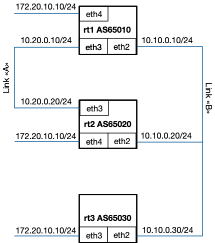
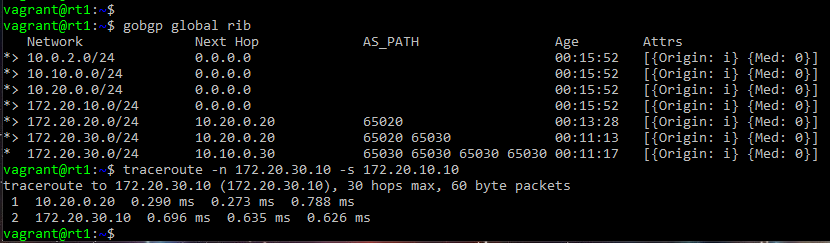
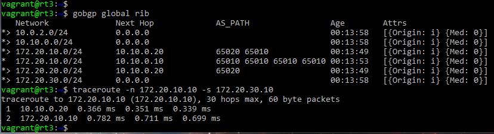

# GoBGP Practical Activity
### Task description
You have the following topology:



GoBGP is installed and peering is configured. Configure BGP policies to ensure that link "A" has higher preference than
link "B" and traffic between ```rt1``` and ```rt3``` passed through ```rt2``` router.
#### 1. Setup Vagrant
Download from https://www.vagrantup.com/downloads.html and install
#### 2. Pull repository
```git clone https://github.com/Astrarog/hse-gobgp-bgp```
#### 3. Setup environment
```
cd hse-gobgp-bgp
vagrant up
```
#### 4. How virtual routers was configured

##### 4.1 Splitting neighbours set

<table>
<tr>
<th>
<pre>
+-----+
| rt1 |
+-----+
</pre>
</th>
<th>
<pre>
+-----+
| rt2 |
+-----+
</pre>
</th>
<th>
<pre>
+-----+
| rt3 |
+-----+
</pre>
</th>
</tr>
<tr>
<td>
<code>
<pre>

\# Neighbors to announce Prefixes
[[defined-sets.neighbor-sets]]
  neighbor-set-name = "rt2-la"
  neighbor-info-list = ["10.20.0.20"]

[[defined-sets.neighbor-sets]]
  neighbor-set-name = "rt2-rt3-lb"
  neighbor-info-list = ["10.10.0.20", "10.10.0.30"]
 
</pre>
</code>
</td>
<td>
<code>
<pre>

\# Neighbors to announce Prefixes
[[defined-sets.neighbor-sets]]
  neighbor-set-name = "rt1-lb"
  neighbor-info-list = ["10.10.0.20"]
 

[[defined-sets.neighbor-sets]]
  neighbor-set-name = "rt1-la-rt3-lb"
  neighbor-info-list = ["10.20.0.10", "10.10.0.30"]
 
</pre>
</code>
</td>
<td>
<code>
<pre>

\# Neighbors to announce Prefixes
[[defined-sets.neighbor-sets]]
  neighbor-set-name = "all-neighbors-no-rt1"
  neighbor-info-list = ["10.10.0.20"]
 
[[defined-sets.neighbor-sets]] 
  neighbor-set-name = "rt1"
  neighbor-info-list = ["10.10.0.10"]
 
</pre>
</code>
</td>
</tr>
</table>

##### 4.2 Creating new export policies

<table>
<tr>
<th>
<pre>
+-----+
| rt1 |
+-----+
</pre>
</th>
<th>
<pre>
+-----+
| rt2 |
+-----+
</pre>
</th>
<th>
<pre>
+-----+
| rt3 |
+-----+
</pre>
</th>
</tr>
<tr>
<td>
<code>
<pre>

\# Export Policy
[[policy-definitions]]
  name = "export-policy"
  [[policy-definitions.statements]]
    name = "export-local-net-to-la"
    [policy-definitions.statements.conditions.match-prefix-set]
      prefix-set = "local-net"
    [policy-definitions.statements.conditions.match-neighbor-set]
      neighbor-set = "rt2-la"
    [policy-definitions.statements.actions]
      route-disposition = "accept-route"

  [[policy-definitions.statements]]
    name = "export-local-net-to-lb"
    [policy-definitions.statements.conditions.match-prefix-set]
      prefix-set = "local-net"
    [policy-definitions.statements.conditions.match-neighbor-set]
      neighbor-set = "rt2-rt3-lb"
    [policy-definitions.statements.actions]
      route-disposition = "accept-route"
	[policy-definitions.statements.actions.bgp-actions]
	  [policy-definitions.statements.actions.bgp-actions.set-as-path-prepend]
        as = "65010"
        repeat-n = 3
 
</pre>
</code>
</td>
<td>
<code>
<pre>

\# Prefixes to announce
[[defined-sets.prefix-sets]]
  prefix-set-name = "local-net"
  [[defined-sets.prefix-sets.prefix-list]]
    ip-prefix = "172.20.20.0/24"
    masklength-range = "24..24"

[[defined-sets.prefix-sets]]
  prefix-set-name = "all-net"
  [[defined-sets.prefix-sets.prefix-list]]
    ip-prefix = "172.20.0.0/16"
    masklength-range = "24..24"

\# Export Policy
[[policy-definitions]]
  name = "export-policy"
  [[policy-definitions.statements]]
    name = "export-local-net"
    [policy-definitions.statements.conditions.match-prefix-set]
      prefix-set = "local-net"
    [policy-definitions.statements.conditions.match-neighbor-set]
      neighbor-set = "rt1-lb"
    [policy-definitions.statements.actions]
      route-disposition = "accept-route"
    
  [[policy-definitions.statements]]
    name = "export-all"
    [policy-definitions.statements.conditions.match-prefix-set]
      prefix-set = "all-net"
    [policy-definitions.statements.conditions.match-neighbor-set]
      neighbor-set = "rt1-la-rt3-lb"
    [policy-definitions.statements.actions]
      route-disposition = "accept-route"
 
</pre>
</code>
</td>
<td>
<code>
<pre>

\# Export Policy
[[policy-definitions]]
  name = "export-policy"
  [[policy-definitions.statements]]
    name = "export-local-net-no-rt1"
    [policy-definitions.statements.conditions.match-prefix-set]
      prefix-set = "local-net"
    [policy-definitions.statements.conditions.match-neighbor-set]
      neighbor-set = "all-neighbors-no-rt1"
    [policy-definitions.statements.actions]
      route-disposition = "accept-route"

  [[policy-definitions.statements]]
    name = "export-local-net-to-rt1"
    [policy-definitions.statements.conditions.match-prefix-set]
      prefix-set = "local-net"
    [policy-definitions.statements.conditions.match-neighbor-set]
      neighbor-set = "rt1"
    [policy-definitions.statements.actions]
      route-disposition = "accept-route"
	[policy-definitions.statements.actions.bgp-actions]
	  [policy-definitions.statements.actions.bgp-actions.set-as-path-prepend]
        as = "65030"
        repeat-n = 3

</pre>
</code>
</td>
</tr>
</table>


#### 5. Validate with traceroute

<table>
<tr>
<th>
<pre>
+-----+         +-----+         +-----+
| rt1 |---> --->| rt2 |---> --->| rt3 |
+-----+         +-----+         +-----+
</pre>
</th>
<th>
<pre>
+-----+         +-----+         +-----+
| rt3 |---> --->| rt2 |---> --->| rt1 |
+-----+         +-----+         +-----+
</pre>
</th>
</tr>
<tr>
<td>

</td>
<td>

</td>
</tr>
</table>

#### 6. Destroy VM
```vagrant destroy```
